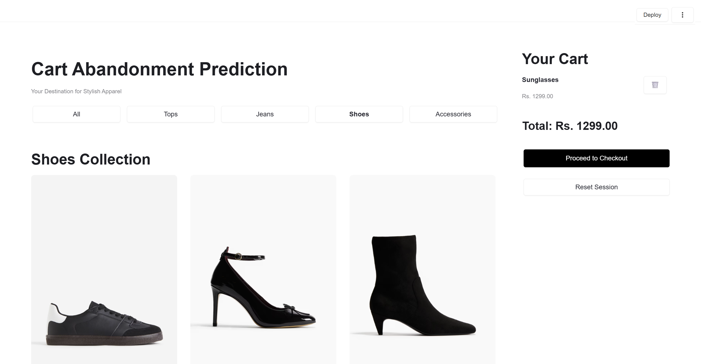
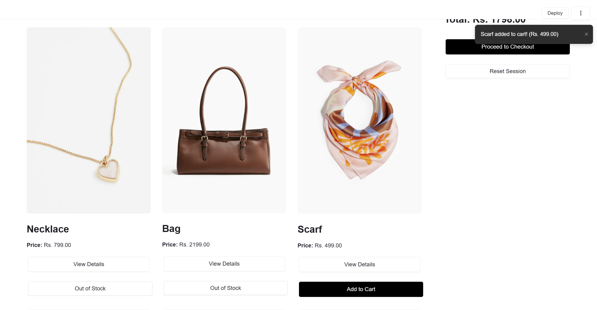
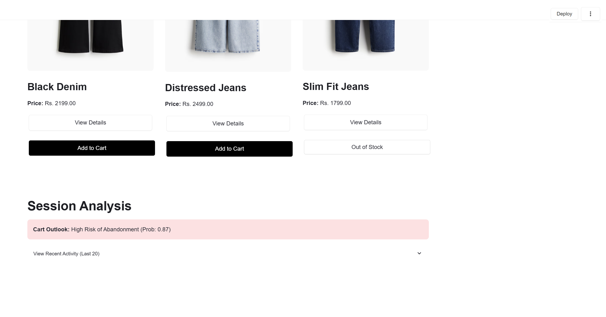

# Cart Abandonment Prediction using RNN

This project implements a deep learning-based system to predict the risk of cart abandonment in e-commerce platforms using sequential user interaction data. It leverages Recurrent Neural Networks (RNNs) to model session-level behavior and identify at-risk user sessions in real-time.

## Objective

To develop a classification model capable of predicting cart abandonment risk based on user session behavior using RNN variants (Simple RNN and GRU).

## Dataset

- **Source**: Retailrocket Recommender System Dataset
- **Contents**: Event-level logs including product views, cart additions, and purchases.
- **Scope**: Session-based, anonymized data from a real e-commerce platform.

## Techniques Used

- Recurrent Neural Networks (Simple RNN, GRU)
- Sequential session modeling
- Padding and temporal feature encoding
- Supervised learning with binary classification

## Methodology

1. **Data Preprocessing**
   - Chronological ordering of session events
   - Removal of incomplete/noisy records
   - Categorical encoding of event types
   - Temporal interval feature creation
   - Sequence padding/truncation

2. **Model Architecture**
   - Masking layer for variable-length sequences
   - Stacked RNN (Simple RNN or GRU) layers
   - Dropout regularization
   - Dense output layer with sigmoid activation

3. **Training Details**
   - Loss Function: Binary Cross-Entropy
   - Optimizer: Adam
   - Epochs: 20–50 with early stopping

## Screenshots

Below are sample output visualizations from the Streamlit app:







---

## How to Run the App

To run the Streamlit application, use the following command in your terminal or command prompt:

```
streamlit run C:\path_to_your_folder\app.py
```

## Results

- RNN-based models outperformed traditional classifiers (Logistic Regression, Random Forest).
- GRU showed slightly better stability and performance compared to Simple RNN.
- Effective for identifying high-risk sessions and enabling real-time interventions.

## Future Work

- Incorporate user demographics and external factors
- Enable real-time deployment for live e-commerce platforms
- Explore attention mechanisms and reinforcement learning for adaptive engagement

## License

This project is for academic and educational use only.
